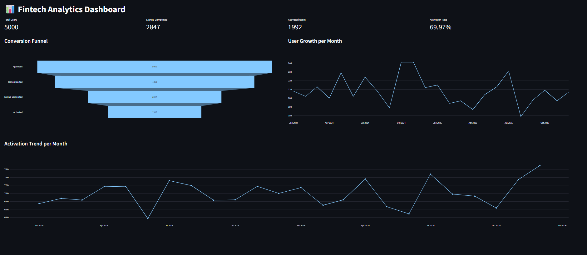

# 📊 Fintech Product Analytics Project

## 🚀 Overview

This project simulates a digital banking product and builds a complete **Product Analytics pipeline**, from data generation to dashboard visualization.

The goal is to analyze user behavior across the product lifecycle, focusing on:

* User acquisition
* Conversion funnel
* Activation
* Engagement
* Revenue

---

## 📊 Dashboard Preview



---

## 🧠 Business Context

The simulated product is a **B2C fintech**, where users can:

* Create an account
* Use the app (web/mobile)
* Perform financial transactions (PIX, card, transfer)
* Request and activate cards

---

## 🏗️ Project Architecture

```
fintech_analytics/

├── app/          # Streamlit dashboard
├── python/       # Data generation (Faker)
├── sql/          # Analytical queries
├── docs/         # Documentation & insights
├── tests/        # Data validation
```

### Data Layers

* **Raw** → simulated data (PostgreSQL)
* **Analytics** → SQL transformations
* **Metrics** → KPIs for dashboard

---

## 🗄️ Data Model

Main entities:

* Users
* Events
* Accounts
* Cards
* Transactions

Relationship:

```
users
 ├── accounts
 │     ├── cards
 │     └── transactions
 └── events
```

---

## 📊 Key Metrics

### Conversion Funnel

* App Open → Signup Started → Signup Completed → Activated

### Activation Rate

* % of users who perform their first transaction

### Engagement

* DAU / MAU
* Transactions per user

### Revenue

* Total transaction volume
* Average transaction value

---

## 🧪 Data Generation

* Synthetic data generated using **Faker**
* Controlled funnel conversion:

  * 85% → signup started
  * 67% → signup completed
  * 70% → activation
* 24 months of data (2024–2025)

---

## 📈 Dashboard

Built with **Streamlit + Plotly**

Includes:

* KPIs (Users, Activation, Revenue)
* Conversion Funnel
* User Growth
* Activation Trend

---

## ⚙️ How to Run

### 1. Install dependencies

```
pip install -r requirements.txt
```

### 2. Run data generation

```
python python/data_creation.py
```

### 3. Start dashboard

```
streamlit run app/app.py
```

---

## 💡 Insights Example

* Drop-off is highest between signup started and completed
* Activation stabilizes after onboarding optimization
* Revenue driven mostly by PIX transactions

---

## 🎯 Skills Demonstrated

* Data Modeling (relational)
* SQL for analytics
* Python (data generation & processing)
* Product Analytics
* Dashboard development (Streamlit)
* Business thinking

---

## 👨‍💻 Author

Project developed as a portfolio to demonstrate **Data & Product Analytics skills**.
